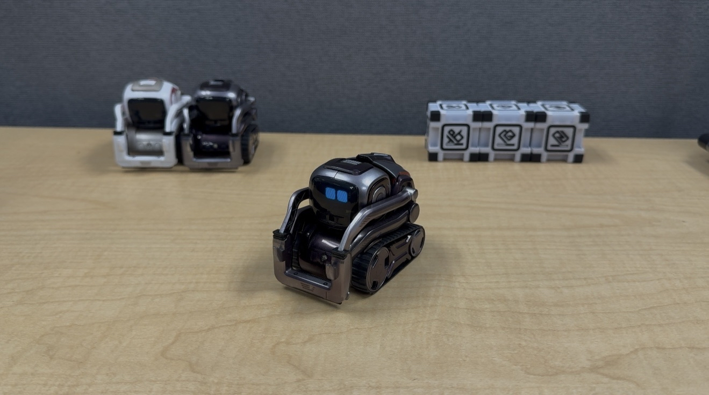

# Child-Level Language Generation Using Reinforcement Learning

This repository presents a project for generating **child-like utterances** (specifically **age 2 and under**) using **reinforcement learning**, the **CHILDES dataset**, and a **small language model**. It fine-tunes the `SmolLM2-360M-Instruct` model using **Group Relative Policy Optimization (GRPO)** guided by three custom reward models:

-  **Childlikeness**
-  **Coherence**
-  **Length Appropriateness**

The goal is to create **age-specific dialogue** that can be used in **educational systems** and **child-robot interaction**.

## Human Subject Evaluation

After training with GRPO, the model was deployed on a Cozmo robot and evaluated in a human-subject study. Feedback from participants was gathered to assess the child-likeness and interaction quality of the generated responses.

## File Descriptions

### `childlikeness_reward.py`

This script **fine-tunes a BERT-based model** as a **binary classifier** to determine whether a given utterance resembles speech produced by a young child (age 2 or younger). The resulting model outputs **child-likeness scores** that are later used as a **reward signal** during GRPO training.

---

### `grpo_training.py`

Uses the **three custom reward functions** in combination with the **GRPO (Group Relative Policy Optimization)** algorithm to fine-tune the `SmolLM2-360M-Instruct` model.

- **`compute_child_likeness_reward()`**  
  Uses the fine-tuned BERT model to return scores indicating how child-like a response is.

- **`compute_coherence_score()`**  
  Evaluates the coherence between a prompt and its response using a pre-trained model.

- **`compute_length_reward()`**  
  Penalizes overly long or complex responses and rewards shorter utterances more typical of toddler speech.
